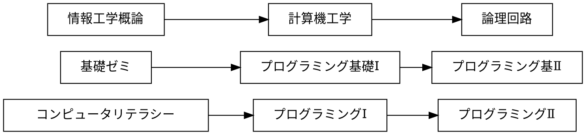
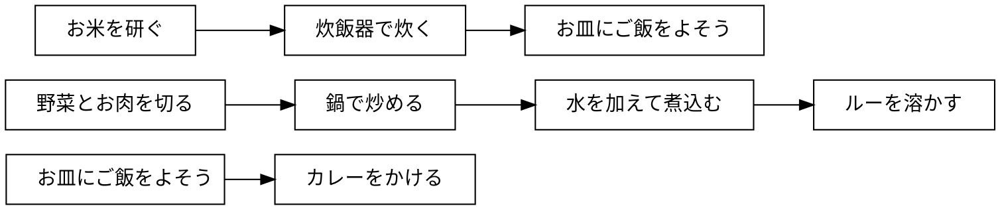

# マークダウンによる図の作成

講義資料と sample.md 内の記述を参考にして，exercise.md 内の4つの課題に回答せよ．

### ex01




### ex02

```plantUML
@startwbs 
* 拓殖大学
** 商学部
*** 経営学科
*** 国際ビジネス学科
*** 会計学科

** 政経学部
*** 法律政治学科
*** 経済学科

** 外国語学部
*** 英米語学科
*** 中国語学科
*** スペイン話学科
*** 国際日本語学科

** 工学部
*** 機械システム工学科
*** 電子システム工学科
*** 情報工学科
*** デザイン学科

** 国際学部
*** 国際学科

@endwbs
```

### ex03

```plantUML
@startuml 
left to right direction
actor "学生" as student
actor "教員" as faculty
rectangle  {
usecase "提出結果の採点" as 100
    usecase "リモートリポジトリにpush"  as 101
    usecase "修正のコミット" as 102
    usecase "修正をステージに上げるh" as 103
    usecase "課題ファイルの修正" as 104
    usecase "リポジトリのクローン" as 105
    usecase "課題の受領" as 106
    usecase "課題の登録" as 107
student --> 106 
student --> 105
student --> 104
student --> 103
student --> 102
100 <-- faculty
107 <-- faculty
@enduml
```
}


### ex04

```plantUML
@startuml
start

:変数 sum を 0 で初期化する;
:変数 i を 0 で初期化する;

while (i が 10 より小さい) is (yes)
  :sum に i を加える;
  :i を 1 増やす;
endwhile (no)
:sum の値を出力する;
stop
@enduml
```


### exmd
