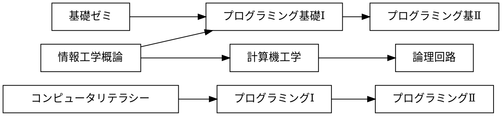
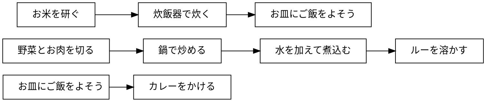

# 課題

## 課題 3.1 有向グラフ


プレビュー結果が上の図のようになるように，下記の記述を完成させよ．(接続関係が正しければ，上下が入れ替わっても構わない)

※ 日本語の文字列に対する箱の大きさが適切でない場合には，前後に空白を入れて調整せよ



## 課題 3.2 WBS


プレビュー結果が上の図のようになるように，下記の記述を完成させよ．(色や影などの違いは気にしなくてよい)

```plantUML
@startwbs 
* 拓殖大学
** 商学部
*** 経営学科
*** 国際ビジネス学科
*** 会計学科

** 政経学部
*** 法律政治学科
*** 経済学科

** 外国語学部
*** 英米語学科
*** 中国語学科
*** スペイン話学科
*** 国際日本語学科

** 工学部
*** 機械システム工学科
*** 電子システム工学科
*** 情報工学科
*** デザイン学科

** 国際学部
*** 国際学科

@endwbs
```


## 課題 3.3 ユースケース図


プレビュー結果が上の図のようになるように，下記の記述を完成させよ．ただし，別名については適当に設定してよい．(色や影などの違いは気にしなくてよい)

```plantUML
@startuml 
left to right direction
actor "学生" as student
actor "教員" as faculty
rectangle  {
usecase "提出結果の採点" as 100
    usecase "リモートリポジトリにpush"  as 101
    usecase "修正のコミット" as 102
    usecase "修正をステージに上げるh" as 103
    usecase "課題ファイルの修正" as 104
    usecase "リポジトリのクローン" as 105
    usecase "課題の受領" as 106
    usecase "課題の登録" as 107
student --> 106 
student --> 105
student --> 104
student --> 103
student --> 102
100 <-- faculty
107 <-- faculty
@enduml
```
}

## 課題 3.4 オリジナルの図解

「有向グラフ」「WBS」「ユースケース図」のどれかを使って，
独自の図解を作成せよ．対象は自由に決めてよいが，
誰かのコピーにならないように留意せよ．




## チェック
- [x] 課題 3.1 有向グラフ
- [x] 課題 3.2 WBS
- [x] 課題 3.3 ユースケース図
- [x] 課題 3.4 オリジナルの図解
